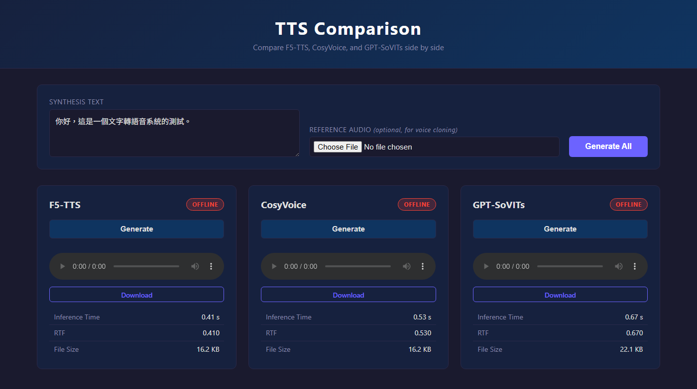
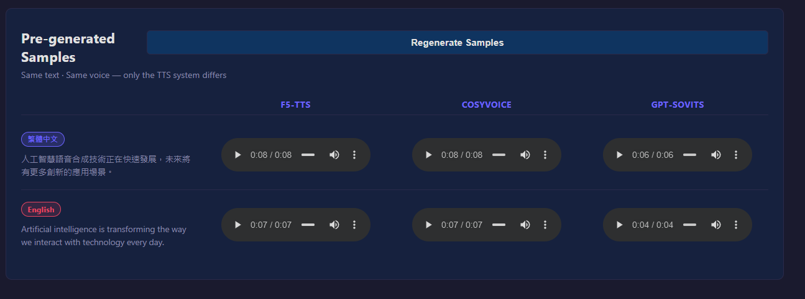

# TTS Comparison

A local web application to deploy and compare three open-source text-to-speech systems — **F5-TTS**, **CosyVoice**, and **GPT-SoVITs** — side by side.

> **Note:** Real models are not required to run. Stub implementations using [edge-tts](https://github.com/rany2/edge-tts) (Microsoft Neural TTS) make the full UI testable immediately, and are designed to be swapped for real model inference once installed.

---

## Screenshots

### Main Interface — Live Generation


### Pre-generated Demo Samples


---

## Features

- **Side-by-side comparison** of F5-TTS, CosyVoice, and GPT-SoVITs
- **Live synthesis** — enter any text and generate with all three models in parallel
- **Traditional Chinese support** (`zh-TW`) out of the box
- **Reference audio upload** for voice cloning (passed to models that support it)
- **Metrics display** — Inference Time, RTF (Real-Time Factor), File Size per model
- **Pre-generated demo samples** — 3 scenarios (繁中 Female, 繁中 Male, English Female)
- **Download** generated audio files
- Dark theme, responsive layout

---

## Project Structure

```
project_tts/
├── frontend/
│   ├── index.html          # Main UI
│   ├── style.css           # Dark theme, CSS Grid layout
│   ├── app.js              # Fetch API, parallel generation, health check
│   └── samples/            # Pre-generated demo audio (9 × .mp3)
└── AI_end/
    ├── server.py           # FastAPI app (port 8000)
    ├── config.py           # Model paths, output dir, port
    ├── requirements.txt
    ├── generate_samples.py # Script to regenerate demo audio
    └── models/
        ├── base.py         # Abstract BaseTTS class
        ├── f5_tts.py       # F5-TTS wrapper (stub → real)
        ├── cosyvoice.py    # CosyVoice wrapper (stub → real)
        └── gpt_sovits.py   # GPT-SoVITs wrapper (stub → real)
```

---

## Quick Start

### 1. Install dependencies

```bash
cd AI_end
pip install -r requirements.txt
```

### 2. Start the backend

```bash
python server.py
# Server starts at http://localhost:8000
```

### 3. Open the frontend

Open `frontend/index.html` directly in your browser, **or** serve it:

```bash
# From project root
python -m http.server 5500
# Then open http://localhost:5500/frontend/index.html
```

### 4. Regenerate demo samples (optional)

```bash
cd AI_end
python generate_samples.py
```

---

## API Reference

| Method | Path | Description |
|--------|------|-------------|
| `GET` | `/api/health` | Returns loaded status for all 3 models |
| `POST` | `/api/tts/f5` | Generate speech with F5-TTS |
| `POST` | `/api/tts/cosyvoice` | Generate speech with CosyVoice |
| `POST` | `/api/tts/gptsovits` | Generate speech with GPT-SoVITs |
| `GET` | `/api/audio/{filename}` | Serve generated audio file |

**Request body** (POST endpoints):

```json
{
  "text": "你好，這是語音合成測試。",
  "reference_audio": "<base64-encoded WAV, optional>"
}
```

**Response:**

```json
{
  "model": "f5",
  "audio_url": "/api/audio/f5_abc123.mp3",
  "inference_time": 1.23,
  "rtf": 0.45,
  "file_size_kb": 42.1
}
```

---

## Demo Sample Voices (Stub Mode)

| Sample | F5-TTS | CosyVoice | GPT-SoVITs |
|--------|--------|-----------|------------|
| 繁體中文 Female | zh-TW-HsiaoChenNeural | zh-TW-HsiaoYuNeural | zh-CN-XiaoxiaoNeural |
| 繁體中文 Male | zh-TW-YunJheNeural | zh-CN-YunxiNeural | zh-CN-YunjianNeural |
| English Female | en-US-JennyNeural | en-US-AriaNeural | en-GB-SoniaNeural |

---

## Swapping Stubs for Real Models

1. Install the real model (e.g. F5-TTS, CosyVoice, GPT-SoVITs)
2. Fill in `AI_end/config.py`:

```python
MODEL_PATHS = {
    "f5_tts":    "/path/to/f5-tts/model",
    "cosyvoice": "/path/to/cosyvoice/model",
    "gpt_sovits": "/path/to/gpt-sovits",
}
```

3. In the corresponding wrapper file (e.g. `models/f5_tts.py`):
   - Uncomment the real import line
   - Remove `raise ImportError(...)`
   - Fill in the `_real_generate` method body

---

## Requirements

- Python 3.10+
- Internet connection (for stub mode — edge-tts calls Microsoft Neural TTS)
- No GPU required in stub mode

---

## License

MIT
