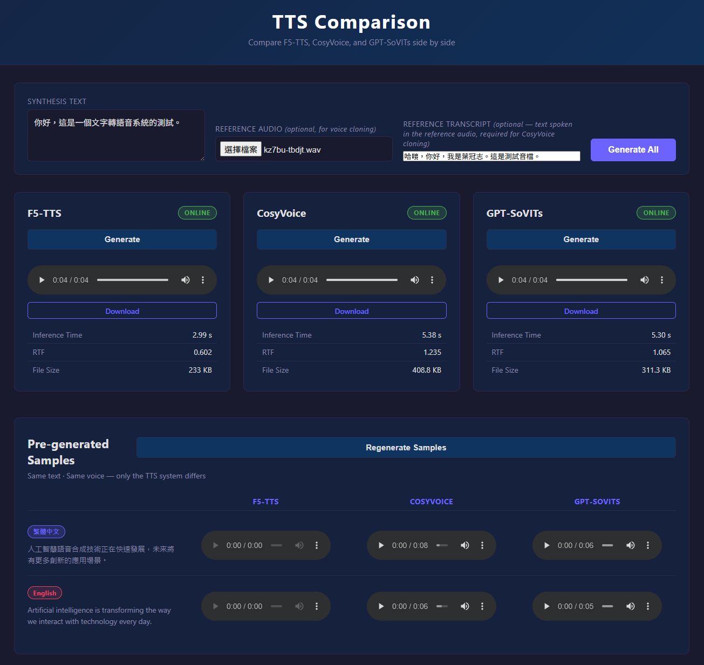

# TTS 語音合成比較平台

本專案是一個本地端網頁應用程式，可同時部署並比較三個開源語音合成系統：**F5-TTS**、**CosyVoice** 與 **GPT-SoVITs**，讓使用者能夠直接聆聽各系統的輸出差異。

支援**繁體中文**與英文輸入，並可上傳參考音訊進行聲音複製（Voice Cloning）。

---

## 網頁截圖

### 主介面 — 即時語音合成


### 預生成範例區塊


---

## 功能特色

- **三系統並排比較**：同時對 F5-TTS、CosyVoice、GPT-SoVITs 發出合成請求
- **即時合成**：輸入任意文字，點擊「Generate All」同時生成三份音訊
- **繁體中文支援**：原生支援繁中輸入（zh-TW）
- **預設參考音訊**：放置 `ref_audio/reference.wav` + `ref_audio/reference.txt`，三個模型無需每次上傳即可進行聲音複製
- **參考音訊上傳**：亦可從介面上傳自訂 `.wav` 檔案並填寫逐字稿（Reference Transcript）進行聲音複製
- **效能指標顯示**：每個模型顯示推理時間、RTF（即時因子）、檔案大小
- **預生成示範音訊**：繁中／英文各一列，點擊「Regenerate Samples」可重新使用預設參考音訊生成
- **下載功能**：可直接下載各模型生成的音訊檔案
- 深色主題、響應式排版

---

## 使用模型

| 模型 | Checkpoint | 參數量 | 架構 | 聲音複製 |
|------|-----------|--------|------|---------|
| **F5-TTS** | `SWivid/F5-TTS` → `F5TTS_Base` | ~335M | Flow Matching + DiT（Diffusion Transformer）+ Vocos Vocoder | 需提供參考音訊（支援自動 ASR 轉錄） |
| **CosyVoice2** | `FunAudioLLM/CosyVoice2-0.5B` | ~500M | Flow Matching + LLM Encoder | 需提供參考音訊 + 逐字稿（Zero-shot Cloning） |
| **GPT-SoVITS** | `lj1995/GPT-SoVITS`（v2 預訓練） | GPT ~100M + SoVITS Encoder/Decoder | GPT 語言模型 + VITS 聲碼器 | 需提供參考音訊 + 逐字稿 |

> 所有模型皆在本機 GPU 執行推理，不依賴任何雲端 API。

---

## 目錄結構

```
project_tts/
├── frontend/
│   ├── index.html           # 主頁面
│   ├── style.css            # 深色主題、CSS Grid 排版
│   └── app.js               # Fetch API、平行合成、健康檢查
├── AI_end/
│   ├── server.py            # FastAPI 主伺服器（Port 8000）
│   ├── config.py            # 模型路徑、輸出目錄、Port 設定
│   ├── requirements.txt     # 主伺服器依賴套件
│   ├── models/
│   │   ├── worker_base.py   # 子程序 Worker 管理器
│   │   ├── f5_tts.py        # F5-TTS 模型封裝
│   │   ├── cosyvoice.py     # CosyVoice 模型封裝
│   │   └── gpt_sovits.py    # GPT-SoVITs 模型封裝
│   ├── workers/
│   │   ├── f5_worker.py     # F5-TTS 工作程序（在 ttsenv 中執行）
│   │   ├── cosy_worker.py   # CosyVoice 工作程序（在 venv_cosy 中執行）
│   │   └── gpt_worker.py    # GPT-SoVITs 工作程序（在 venv_gpt 中執行）
│   └── outputs/             # 生成的音訊輸出（執行時建立，不納入版控）
├── ref_audio/               # 預設參考音訊（不納入版控）
│   ├── reference.wav        # ← 放置你的參考音訊
│   └── reference.txt        # ← 參考音訊的逐字稿（CosyVoice / GPT-SoVITs 必填）
├── ttsenv/                  # F5-TTS 虛擬環境
├── venv_cosy/               # CosyVoice 獨立虛擬環境
├── venv_gpt/                # GPT-SoVITs 獨立虛擬環境
└── docs/                    # README 截圖
```

---

## 系統需求

| 項目 | 最低需求 |
|------|---------|
| Python | 3.10 以上 |
| GPU | NVIDIA（建議 8GB+ VRAM） |
| CUDA | 12.1 |
| FFmpeg | 需安裝於系統 PATH（見下方說明） |
| 磁碟空間 | 約 20GB（模型 + 虛擬環境） |
| 網路 | 首次安裝需下載模型權重 |

---

## 安裝步驟

### 第零步：安裝 FFmpeg（必要）

F5-TTS 的推理過程需要系統層級的 FFmpeg。使用 winget 安裝（Windows 10/11）：

```bash
winget install Gyan.FFmpeg
```

安裝完成後**重新開啟終端機**，確認 PATH 已更新：

```bash
ffmpeg -version
```

### 第一步：Clone 模型倉庫

```bash
cd <你的工作目錄>
git clone --depth=1 https://github.com/SWivid/F5-TTS.git
git clone --depth=1 --recursive https://github.com/FunAudioLLM/CosyVoice.git
git clone --depth=1 https://github.com/RVC-Boss/GPT-SoVITS.git
git clone https://github.com/yehdanny/TTS_comparision.git project_tts
cd project_tts
```

### 第二步：建立主伺服器虛擬環境（含 F5-TTS）

```bash
python -m venv ttsenv
ttsenv\Scripts\activate
pip install torch==2.5.1+cu121 torchaudio==2.5.1+cu121 --index-url https://download.pytorch.org/whl/cu121
pip install -r AI_end/requirements.txt
pip install f5-tts
```

### 第三步：建立 CosyVoice 虛擬環境

```bash
python -m venv venv_cosy --system-site-packages
venv_cosy\Scripts\pip install "numpy==1.26.4" --force-reinstall --no-deps
venv_cosy\Scripts\pip install "transformers==4.51.3" "tokenizers==0.21.1" \
    conformer==0.3.2 HyperPyYAML==1.2.3 "omegaconf==2.3.0" "hydra-core==1.3.2" \
    "lightning==2.2.4" "librosa==0.10.2" "diffusers==0.29.0" \
    inflect pyworld "onnxruntime==1.18.0" "openai-whisper==20231117" \
    huggingface_hub soundfile opencc-python-reimplemented
```

> `opencc-python-reimplemented` 用於將繁體中文自動轉換為簡體，確保 CosyVoice 分詞器正確運作。

### 第四步：建立 GPT-SoVITs 虛擬環境

```bash
python -m venv venv_gpt --system-site-packages
venv_gpt\Scripts\pip install "numpy==1.26.4" "transformers==4.46.3" \
    "tokenizers==0.20.3" "librosa==0.10.2" "peft==0.13.2" \
    funasr cn2an pypinyin g2p_en jieba sentencepiece chardet \
    rotary_embedding_torch "fast_langdetect>=0.3.1" wordsegment \
    "ctranslate2>=4.0,<5" soundfile huggingface_hub opencc-python-reimplemented
```

### 第五步：下載模型權重

```bash
# CosyVoice2-0.5B（約 1.5GB）
venv_cosy\Scripts\python -c "
from huggingface_hub import snapshot_download
snapshot_download('FunAudioLLM/CosyVoice2-0.5B',
    local_dir='../CosyVoice/pretrained_models/CosyVoice2-0.5B')
"

# GPT-SoVITS 預訓練模型（約 700MB）
venv_gpt\Scripts\python -c "
from huggingface_hub import snapshot_download
snapshot_download('lj1995/GPT-SoVITS',
    local_dir='../GPT-SoVITS/GPT_SoVITS/pretrained_models')
"

# F5-TTS 模型在首次執行時自動從 HuggingFace 下載（約 900MB）
```

### 第六步：準備預設參考音訊

```bash
mkdir ref_audio
# 將你的 WAV 檔複製為 ref_audio/reference.wav
# 並在 ref_audio/reference.txt 中填入該音訊的逐字稿，例如：
echo 你好，這是我的參考音訊。 > ref_audio/reference.txt
```


### 示範音訊聲音對照表（備用模式）

| 示範情境 | F5-TTS | CosyVoice | GPT-SoVITs |
|---------|--------|-----------|------------|
| 繁體中文・女聲 | zh-TW-HsiaoChenNeural | zh-TW-HsiaoYuNeural | zh-CN-XiaoxiaoNeural |
| 繁體中文・男聲 | zh-TW-YunJheNeural | zh-CN-YunxiNeural | zh-CN-YunjianNeural |
| 英文・女聲 | en-US-JennyNeural | en-US-AriaNeural | en-GB-SoniaNeural |


---

## 啟動方式

```bash
cd AI_end
ttsenv\Scripts\activate
python server.py
```

伺服器啟動後會自動在背景載入三個模型（約需 1～3 分鐘）。
看到以下訊息即代表各模型已就緒：

```
INFO  models.worker_base  [F5-TTS] Worker ready (pid=XXXX)
INFO  models.worker_base  [CosyVoice] Worker ready (pid=XXXX)
INFO  models.worker_base  [GPT-SoVITs] Worker ready (pid=XXXX)
```

### 開啟前端頁面

直接在瀏覽器開啟 `frontend/index.html`（不需要額外的 HTTP 伺服器，CORS 已設定為允許 file:// 協議）。

---

## API 說明

| 方法 | 路徑 | 說明 |
|------|------|------|
| `GET` | `/api/health` | 查詢三個模型的載入狀態 |
| `POST` | `/api/tts/f5` | 使用 F5-TTS 合成語音 |
| `POST` | `/api/tts/cosyvoice` | 使用 CosyVoice 合成語音 |
| `POST` | `/api/tts/gptsovits` | 使用 GPT-SoVITs 合成語音 |
| `POST` | `/api/regenerate-samples` | 重新生成預設示範音訊（使用 reference.wav） |
| `GET` | `/api/audio/{filename}` | 取得生成的音訊檔案 |

**POST `/api/tts/*` 請求格式：**

```json
{
  "text": "你好，這是語音合成測試。",
  "reference_audio": "<Base64 編碼的 WAV 音訊（選用）>",
  "ref_text": "參考音訊的逐字稿（CosyVoice 聲音複製必填）"
}
```

**回應格式：**

```json
{
  "model": "f5",
  "audio_url": "/api/audio/f5_abc123.wav",
  "inference_time": 1.23,
  "rtf": 0.45,
  "file_size_kb": 128.5
}
```

---

## 架構說明

本專案採用**多程序獨立環境**架構，解決三個模型之間的 Python 套件版本衝突問題：

```
┌─────────────────────────────────┐
│  FastAPI 主伺服器 (port 8000)    │
│  ttsenv                         │
└──────┬─────────┬────────────────┘
       │ stdin/stdout JSON-lines
  ┌────┴───┐ ┌───┴──────┐ ┌────────────────┐
  │F5-TTS  │ │CosyVoice │ │ GPT-SoVITs     │
  │Worker  │ │Worker    │ │ Worker         │
  │ttsenv  │ │venv_cosy │ │ venv_gpt       │
  └────────┘ └──────────┘ └────────────────┘
```

- 每個模型在獨立的子程序中執行，避免套件衝突
- 主伺服器透過 stdin/stdout 傳送 JSON 請求給各 Worker
- Worker 啟動後持續駐留記憶體，不需每次重新載入模型
- 若模型未載入，自動降級使用 edge-tts（Microsoft 線上 TTS）作為備用

---

## 常見問題

**Q：模型載入很慢怎麼辦？**
A：首次啟動會自動下載模型權重（F5-TTS 約 900MB），之後會從快取讀取，速度較快。

**Q：狀態顯示 Offline？**
A：表示後端伺服器未啟動，或模型載入失敗。請確認已執行 `python server.py` 且無錯誤訊息。

**Q：F5-TTS 出現 ffmpeg 相關錯誤？**
A：請確認已透過 `winget install Gyan.FFmpeg` 安裝 FFmpeg，並在**新開的**終端機中啟動伺服器。

**Q：CosyVoice 合成的內容與輸入文字不符？**
A：請確認 `ref_audio/reference.txt` 中填有正確的參考音訊逐字稿。若從介面上傳自訂音訊，請在「Reference Transcript」欄位填入對應的文字。

**Q：Windows 上 pyworld 安裝失敗？**
A：請確認已安裝 Visual C++ Build Tools，或從 [PyPI](https://pypi.org/project/pyworld/) 下載預編譯的 wheel 檔。

---

## 未來計畫

本平台設計為可擴充架構，後續預計加入更多 TTS 系統進行比較：

| 模型 | 特色 |
|------|------|
| **IndexTTS** | Bilibili 開源，中文表現強，支援零樣本聲音複製 |
| **Kokoro TTS** | 輕量（82M）、高品質、速度快，適合低資源場景 |
| **Spark-TTS** | 基於 LLM 的新一代 TTS，支援多語言與情感控制 |
| **XTTS v2** | Coqui 出品，支援 17 種語言的零樣本跨語言合成 |
| **StyleTTS 2** | 擴散模型驅動的風格遷移 TTS，韻律自然度高 |

---

## 授權

MIT License
